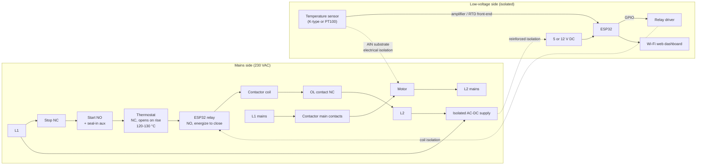
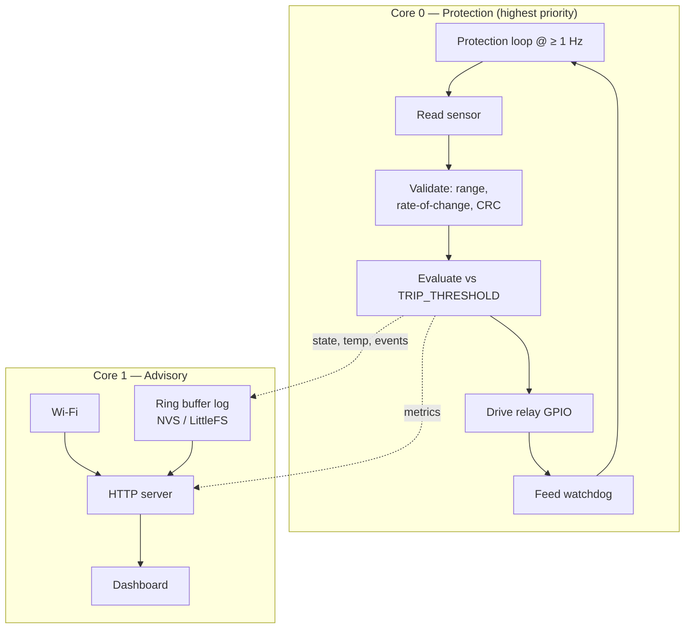
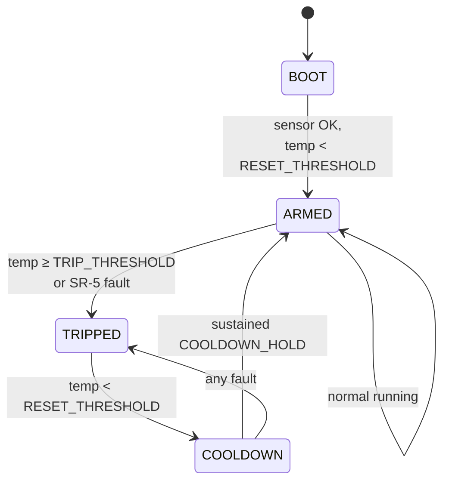

# Architecture

Hardware and software design for the table saw thermal protection retrofit. Companion to the [README](README.md), which covers the *why*.

- [Motor and starter](#motor-and-starter)
- [Control topology](#control-topology)
- [Coil circuit after retrofit](#coil-circuit-after-retrofit)
- [Wiring diagram](#wiring-diagram)
- [Sensor mounting](#sensor-mounting)
- [Bill of materials](#bill-of-materials)
- [Software architecture](#software-architecture)
- [Safety requirements](#safety-requirements)
- [Commissioning](#commissioning)
- [Open questions](#open-questions)

---

## Motor and starter

### Motor

| Field | Value |
|---|---|
| Make/model | Marathon Electric `SXA145TBFR7002AA` |
| OEM part | Powermatic `6472028` |
| Rating | 3 HP, 3500 RPM, 2-pole |
| Supply | 230 V, 1-phase, 60 Hz |
| FLA | 14.4 A |
| Locked rotor | ~90–115 A (estimated, cap-start) |
| Service factor | **1.0 — no thermal margin** |
| Insulation | Class F (155 °C total system) |
| Frame / enclosure | 145TC / TEFC |
| Built | January 2017 |

### Starter

Gould/ITE `A202C`, Class A200, NEMA Size 1, 2-pole. 30 A open rating, 600 V max. Type B bimetallic overload relay (ambient-compensated, manual reset). Date code 1/85.

### Failed part

Klixon `BEC2921` — single-phase phenolic protector, manual reset (red plunger), round body ~1" dia., two screw terminals. Wired in series with the motor line, not the control circuit. Confirmed open; motor windings test good.

---

## Control topology

The starter uses a standard **3-wire momentary Start / maintained Stop with seal-in** arrangement:

```
L1 ──▶ Stop (NC) ──▶ [term 2] ──▶ Start (NO) ──▶ [term 3] ──▶ Coil ──▶ OL contact (NC) ──▶ L2
                          │                          │
                          └──── Seal-in aux (NO) ─────┘
```

Consequences the retrofit relies on:

- Breaking the coil circuit anywhere drops the contactor **and it stays dropped**. The seal-in opens with it.
- Restoring the break does **not** restart the motor. A human must press Start.
- A device that only ever *interrupts* this circuit cannot cause an unexpected start regardless of firmware state.

This is the single most important electrical fact in the design — it is what lets the ESP32's automatic cooldown be safe (SR-4).

---

## Coil circuit after retrofit

Both new protective contacts are added in series with the existing coil circuit. Either opening drops the contactor.

```
L1 ─▶ Stop ─▶ Start/seal-in ─▶ [Thermostat NC] ─▶ [ESP32 relay NO] ─▶ Coil ─▶ OL ─▶ L2
                                    passive            supervisory
                                    primary             (energized
                                                        to close)
```

**Layer responsibilities:**

- **Thermostat (passive primary).** Snap-action bimetal, NC, opens on rise, auto-reset. No power, no firmware, no failure modes that leave it closed when hot. Trip point 120–130 °C — see BOM TASK-6.
- **ESP32 relay (supervisory).** Normally open, energized to close. Loss of ESP32 power, hung firmware, or watchdog reset all de-energize this relay and stop the saw. Trips at a lower threshold than the thermostat so it acts first in normal operation.

---

## Wiring diagram

Full signal flow, mains side and low-voltage side, with the isolation boundary marked.



Notes on the diagram:

- The thermostat and ESP32 relay are in the **coil circuit only**, not the motor line. The motor's line current runs through the contactor's main power contacts directly, bypassing both.
- The isolation boundaries (`PSU_IN → PSU_OUT`, `RelayDrv → RLY` coil, `Sensor → Motor` via AlN) collectively ensure that a fault on the mains side cannot appear at the USB port or the web interface. See SR-7.
- The Wi-Fi block is intentionally shown *off* the protection path. It reads state from the ESP32 but plays no role in tripping.

---

## Sensor mounting

The sensor determines whether the system works at all. A sensor that reads air temperature instead of winding temperature produces confident, useless numbers.

1. Bond the sensor tip to the winding end turns using the AlN substrate as the interface. AlN is thermally conductive and electrically insulating — thermal contact with dielectric separation from a 230 V conductor.
2. Cover the outboard face of the sensor with thermal insulation so it reads the winding, not the air around it.
3. Route leads clear of the rotor. Hand-turn the shaft through a full revolution to verify clearance before reassembly.
4. Secure leads against vibration so they cannot chafe against the winding or the frame.
5. Place the thermostat on the end turns as well, ideally on the **opposite side** from the sensor so they sample independent regions of the winding.

Sensor and thermostat leads inside the motor must be rated for the winding temperature class (PTFE or fiberglass, 600 V). PVC hookup wire will fail there.

---

## Bill of materials

Parts have been purchased. Several need verification before wiring; two are likely wrong and are blocking.

| Item | Status | Action |
|---|---|---|
| ESP32 dev board | OK | — |
| Temperature sensor | ⚠️ **VERIFY** | TASK-1 |
| "220 to 12 V buck converter" | ⚠️ **LIKELY WRONG** | TASK-2 (blocking) |
| "Wireless switch" relay | ⚠️ **VERIFY** | TASK-3 |
| AlN substrate | OK | Thermal interface, electrically isolating |
| Thermal insulation | OK | Shields sensor from ambient air |
| Ring terminals, solder, tips, scrap wire | OK | Motor-interior wire must be temp-rated — TASK-4 |
| Enclosure | OK | TASK-5 |
| **Bimetallic thermostat** | ❌ **NOT PURCHASED** | TASK-6 (blocking, required by SR-3) |

### TASK-1 — Verify sensor temperature range

Class F insulation runs to 155 °C. A sensor bonded to end turns must read reliably to at least 180 °C to be useful near the limit.

**Common failure:** DS18B20 and most cheap digital sensors max out at 125 °C — *below* the trip point. If the purchased sensor is a DS18B20 or similar, it cannot be used.

Suitable alternatives:

- K-type thermocouple + MAX31855 or MAX6675 (amplifier provides some isolation)
- PT100 RTD + MAX31865

Both give headroom well past 200 °C.

### TASK-2 — Power supply isolation (blocking)

"220 to 12 V buck converter" is ambiguous. A *buck* converter is DC-DC. If the purchased part is a non-isolated AC-line supply, the ESP32 ground floats at mains potential — lethal at the USB port and unacceptable per SR-7.

**Required:** an isolated AC-DC supply with reinforced isolation, 230 VAC input, 5 V or 12 V output, from a recognized manufacturer with safety certification. Not a bare non-isolated module.

Do not energize anything until this is resolved.

### TASK-3 — Relay verification

Identify the "wireless switch." Requirements:

- Contacts rated ≥ 250 VAC, with margin for the A200 Size 1 coil inrush (~1 A). A 5 A contact rating is ample.
- Must be usable as a plain **normally-open, energized-to-close** contact under direct GPIO control.

**If it is a consumer Wi-Fi relay whose state is controlled over the network, do not use it in the coil circuit.** Network-commanded state in a safety path violates SR-8. Substitute a plain relay module or an SSR driven directly by GPIO. The purchased device may be repurposed for a non-safety function (e.g. a dust-collector interlock).

### TASK-4 — Wire rating

Sensor leads run against winding end turns. Use PTFE or fiberglass-insulated lead wire rated for the winding temperature class and 600 V. "Scrap wire" is fine for the low-voltage side inside the enclosure, not for the motor interior.

### TASK-5 — Enclosure placement

Mount outside the motor, away from the fan shroud and dust stream. Do not obstruct cooling airflow — restricting airflow to install a device that detects restricted airflow would be a poor outcome. Consider mounting alongside the existing starter enclosure.

### TASK-6 — Source the bimetallic thermostat (blocking)

Required by SR-3. Specification:

- Snap-action bimetallic, **normally closed, opens on temperature rise**
- Auto-reset (the coil circuit's seal-in provides manual restart via the Start button)
- Open temperature: **120–130 °C.** Class F allows 155 °C, but a thermostat clamped to end turns reads cooler than the winding hot spot, and this motor has already been thermally abused. Stay at the low end.
- Rated ≥ 250 VAC, ≥ 2 A
- **Not a thermal fuse** — those are one-shot

---

## Software architecture

Suggested stack: ESP-IDF or Arduino-ESP32. Wi-Fi and web server run on a separate task/core from the protection loop so a network stall cannot delay a trip.

### Task layout



The protection loop must not depend on Wi-Fi, NTP, filesystem, or the web server. The watchdog is fed **only** after a complete successful cycle — a hung sensor task starves it and forces a reset, which opens the relay.

### State machine



- `BOOT`: relay open, self-test.
- `ARMED`: relay closed, saw may run.
- `TRIPPED`: relay open, event logged, alert raised.
- `COOLDOWN`: relay still open, timer running to prevent chatter.

Notes:

- `TRIPPED → COOLDOWN → ARMED` re-closes the relay automatically. Per SR-4 this is safe: the saw does not restart until the operator presses the physical Start button.
- Trip events persist across power loss. On boot, if the last state was `TRIPPED`, require a fresh temperature check before arming.

### Thresholds (defaults, configurable)

| Constant | Default | Note |
|---|---|---|
| `TRIP_THRESHOLD` | 110 °C | Below the thermostat, so ESP32 acts first |
| `WARN_THRESHOLD` | 95 °C | Advisory alert only, no trip |
| `RESET_THRESHOLD` | 70 °C | Must fall below this to leave TRIPPED |
| `COOLDOWN_HOLD` | 120 s | Sustained below RESET before arming |
| `SENSOR_TIMEOUT` | 3 s | No valid reading in this window → trip |

Confirm against the thermostat's actual rating once TASK-6 is closed. `TRIP_THRESHOLD` must sit meaningfully below the thermostat's open temperature.

### Logging

- Ring buffer in flash (NVS or LittleFS), survives power loss.
- Records: timestamp, temperature, state transitions, trip cause.
- Retain at least 30 days of run data and all trip events.
- Rate-of-rise tracking — a °C/min figure climbing across sessions is the early indicator that the shroud is packing up again.

### Web dashboard

- Served locally from the ESP32; no cloud dependency.
- Live temperature, current state, time in state.
- History chart, trip event log.
- Alert display for `WARN_THRESHOLD` and rate-of-rise anomalies.
- **Read-only with respect to protection.** May acknowledge alerts. May not lower thresholds, force-arm, or close the relay. Enforce server-side, not just in the UI.

---

## Safety requirements

Non-negotiable. Any change that appears to violate one of these is wrong until proven otherwise.

**SR-1 — Fail-safe relay topology.** The ESP32's relay is **normally-open, energized-to-close**, wired in series with the contactor coil. Loss of ESP32 power, loss of firmware execution, or a watchdog reset de-energizes the relay, opens the coil circuit, and stops the saw.

**SR-2 — Interrupt-only.** No output of this system connects to anything that could energize the contactor coil. The only permitted electrical function is opening a series contact. Verify by inspection of wiring, not by reading firmware.

**SR-3 — Passive primary retained.** A bimetallic snap-action thermostat (NC, opens on rise) is wired in series in the same coil circuit, independent of the ESP32. It is the primary protection. The ESP32 trips at a lower threshold so it normally acts first, but the thermostat is the backstop.

**SR-4 — No autonomous start.** Recovery from a thermal event re-closes the ESP32 relay only. Restarting the saw requires a physical press of the Start button. Guaranteed by the 3-wire seal-in topology, not by firmware.

**SR-5 — Sensor fault is a trip condition.** Open sensor, shorted sensor, out-of-range reading, stale reading, CRC/communication failure — all trip. Never fall back to "last known good" or "assume ambient."

**SR-6 — Watchdog.** Hardware watchdog enabled. Main loop feeds it only after a successful sensor read and threshold evaluation. A hung sensor task must starve the watchdog, not be papered over.

**SR-7 — Galvanic isolation.** The sensor is bonded to winding end turns at 230 V potential. The low-voltage side (ESP32, USB, web interface) must be isolated from mains. See TASK-2 for the specific concern that must be resolved before any wiring.

**SR-8 — Network is advisory only.** The web interface may display state, history, and alerts, and may acknowledge a fault. It may **not** be required for protection to function. Wi-Fi down = system still protects. Treat all network input as untrusted.

---

## Commissioning

Do not cut wood until all of these pass.

1. **Bench, no mains.** Verify relay de-energizes on: power removal, firmware crash (force one), sensor disconnect, watchdog timeout. Relay must open in every case.
2. **Bench, heat gun on sensor.** Verify trip at `TRIP_THRESHOLD`, state machine transitions, log entries.
3. **Isolation check.** Confirm no continuity between mains side and low-voltage side. Confirm the AlN isolation with a meter before installing the motor's end bell.
4. **Coil circuit, motor disconnected.** Press Start, confirm contactor pulls in. Force a trip, confirm contactor drops out. Confirm it does **not** re-latch when the trip clears — Start must be pressed.
5. **Thermostat independent test.** Unplug the ESP32 entirely. Confirm the saw still runs and that the thermostat alone is in circuit.
6. **First run under load.** Watch the temperature curve through a normal cutting session. Record the steady-state figure — that becomes the baseline the warning threshold is calibrated against.

---

## Open questions

1. What is the actual temperature sensor part number? (TASK-1)
2. Is the power supply isolated? (TASK-2 — blocking)
3. What is the "wireless switch," and is it GPIO-controllable as a plain relay? (TASK-3)
4. Has the thermostat been ordered? (TASK-6 — blocking for SR-3)
5. Should the dust collector be interlocked to the saw? The purchased wireless relay might serve here, outside the safety path, and it addresses root cause.
6. Is a `BEC2921` or a Sensata supersession still worth pursuing in parallel as a fallback?
