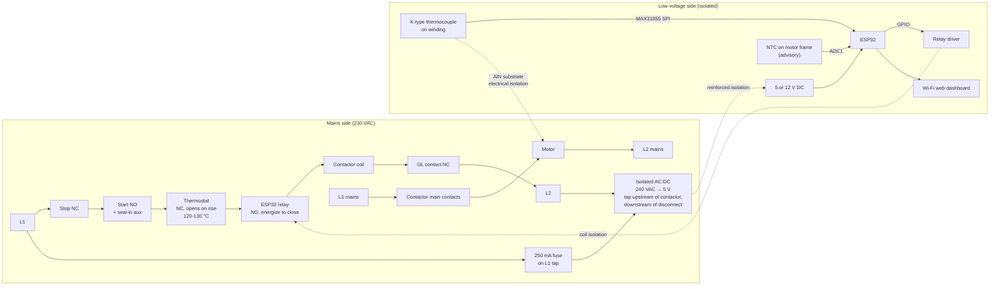
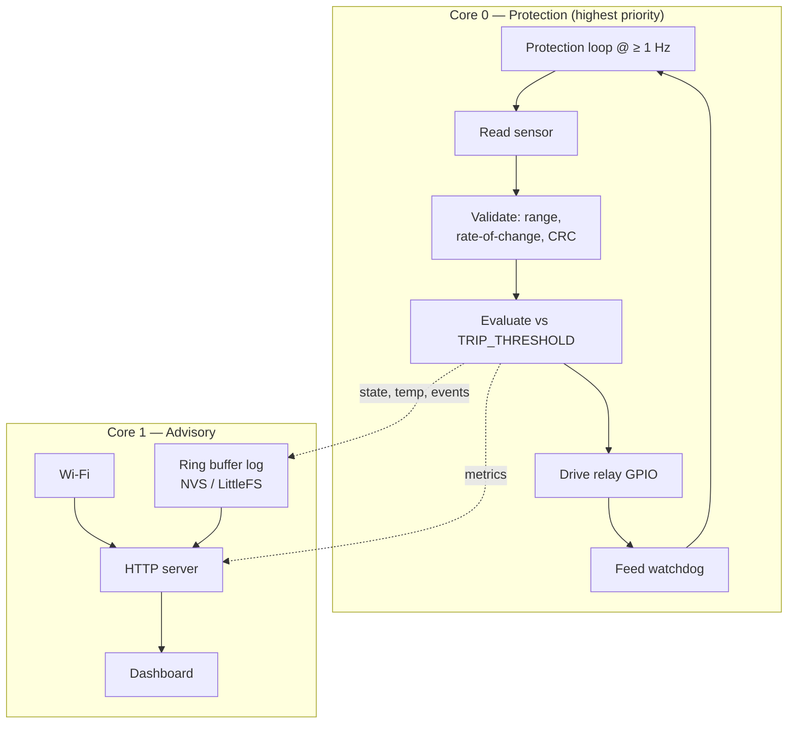
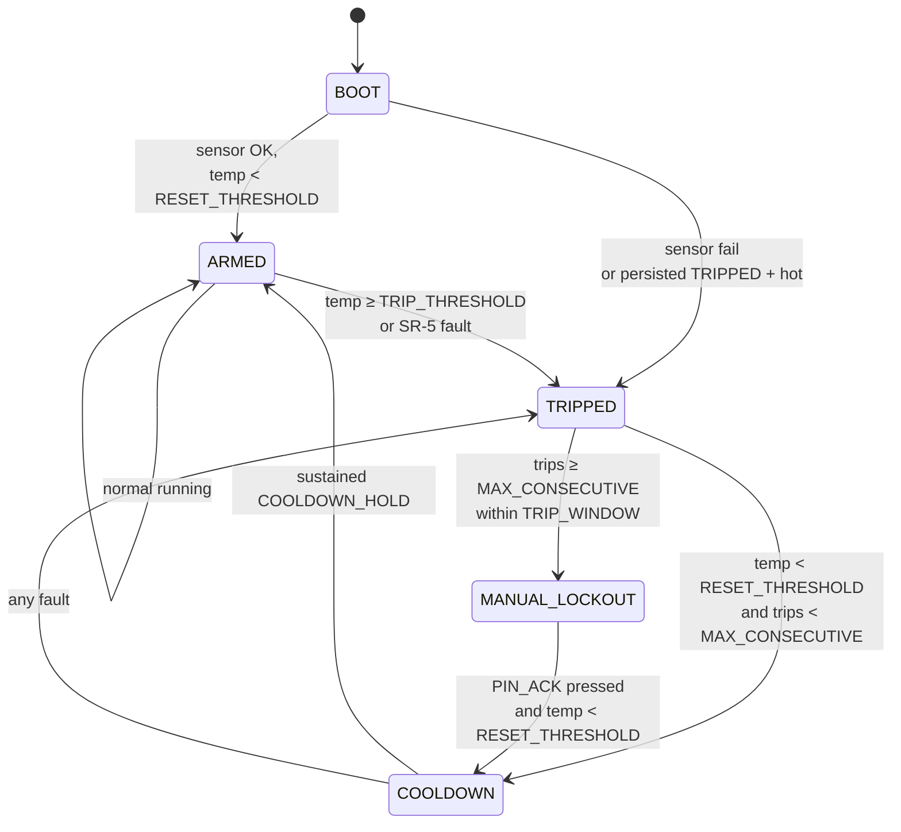

# Architecture

Hardware and software design for the table saw thermal protection retrofit. Companion to the [README](README.md), which covers the *why*. For the same-day expedient build using only parts on hand, see [BUILD-TONIGHT.md](BUILD-TONIGHT.md).

> **DANGER — 240 VAC throughout.** Every wiring section in this document sits on live mains. Before touching any of it:
> - Lock out and tag out the machine disconnect. Physically lock a breaker in the OFF position.
> - Verify L1, L2, and the coil-circuit terminals read 0 V with a multimeter you have first tested on a known-live circuit.
> - Treat incoming L1 / L2 as live until proven otherwise — control-transformer or shared-neutral feedback is real.
> - If the enclosure is metal, bond it to safety ground with a #10 or larger conductor at the ground stud. If plastic, no bond is needed.
> - PPE: safety glasses. Insulated tools where you cannot fully de-energize.

- [Motor and starter](#motor-and-starter)
- [Control topology](#control-topology)
- [Coil circuit after retrofit](#coil-circuit-after-retrofit)
- [Power supply](#power-supply)
- [Wiring diagram](#wiring-diagram)
- [Pin assignments](#pin-assignments)
- [Why RF was rejected as the primary path](#why-rf-was-rejected-as-the-primary-path)
- [Sensor mounting](#sensor-mounting)
- [Bill of materials](#bill-of-materials)
- [Software architecture](#software-architecture)
- [Reference pseudocode](#reference-pseudocode)
- [Sensor calibration](#sensor-calibration)
- [Safety requirements](#safety-requirements)
- [Commissioning](#commissioning)
- [Open questions](#open-questions)

---

## Motor and starter

### Motor

| Field | Value |
|---|---|
| Make/model | Marathon Electric `SXA145TBFR7002AA` |
| OEM part | Powermatic `6472028` |
| Rating | 3 HP, 3500 RPM, 2-pole |
| Supply | 230 V, 1-phase, 60 Hz |
| FLA | 14.4 A |
| Locked rotor | ~90–115 A (estimated, cap-start) |
| Service factor | **1.0 — no thermal margin** |
| Insulation | Class F (155 °C total system) |
| Frame / enclosure | 145TC / TEFC |
| Built | January 2017 |

### Starter

Gould/ITE `A202C`, Class A200, NEMA Size 1, 2-pole. 30 A open rating, 600 V max. Type B bimetallic overload relay (ambient-compensated, manual reset). Date code 1/85.

### Failed part

Klixon `BEC2921` — single-phase phenolic protector, manual reset (red plunger), round body ~1" dia., two screw terminals. Wired in series with the motor line, not the control circuit. Confirmed open; motor windings test good.

---

## Control topology

The starter uses a standard **3-wire momentary Start / maintained Stop with seal-in** arrangement:

```
L1 ──▶ Stop (NC) ──▶ [term 2] ──▶ Start (NO) ──▶ [term 3] ──▶ Coil ──▶ OL contact (NC) ──▶ L2
                          │                          │
                          └──── Seal-in aux (NO) ─────┘
```

Consequences the retrofit relies on:

- Breaking the coil circuit anywhere drops the contactor **and it stays dropped**. The seal-in opens with it.
- Restoring the break does **not** restart the motor. A human must press Start.
- A device that only ever *interrupts* this circuit cannot cause an unexpected start regardless of firmware state.

This is the single most important electrical fact in the design — it is what lets the ESP32's automatic cooldown be safe (SR-4).

---

## Coil circuit after retrofit

Both new protective contacts are added in series with the existing coil circuit. Either opening drops the contactor.

```
L1 ─▶ Stop ─▶ Start/seal-in ─▶ [Thermostat NC] ─▶ [ESP32 relay NO] ─▶ Coil ─▶ OL ─▶ L2
                                    passive            supervisory
                                    primary             (energized
                                                        to close)
```

**Layer responsibilities:**

- **Thermostat (passive primary).** Snap-action bimetal, NC, opens on rise, auto-reset. No power, no firmware, no failure modes that leave it closed when hot. Trip point 120–130 °C — see BOM TASK-6.
- **ESP32 relay (supervisory).** Normally open, energized to close. Loss of ESP32 power, hung firmware, or watchdog reset all de-energize this relay and stop the saw. Trips at a lower threshold than the thermostat so it acts first in normal operation.

---

## Power supply

The ESP32 supervisor is powered from an **isolated AC-DC module tapped in parallel with the motor supply lines**, downstream of the machine disconnect and upstream of the contactor. This gives the supervisor power whenever the machine is enabled at the wall, independent of Start/Stop state and independent of anything the coil circuit does.

```
Machine disconnect ──┬── L1 ──▶ Contactor main ──▶ Motor ──▶ L2 ──┬── (back to disconnect)
                     │                                             │
                     │  ┌─[250 mA fuse]─┐                          │
                     └──┤  L1 tap       ├─ Isolated AC-DC ─────────┘
                        └───────────────┘   240 VAC → 5 V   L2 tap
                                            reinforced isolation
                                                   │
                                                   ▼
                                                +5 V ─▶ ESP32
                                                GND
```

### Requirements

- **Isolated, reinforced-isolation AC-DC.** Not a bare non-isolated module. A "220→12V buck converter" sold as a small green PCB is typically **not** isolated; if the input and output share a ground, the ESP32 ground floats at mains potential — lethal at the USB port, incompatible with SR-7. Recommended certified modules: **Mean Well IRM-05-5** (5 V, 5 W, 85–305 VAC input, PCB mount), **Recom RAC03-05SK**, or equivalents from TDK-Lambda / XP Power. Cost is under $15.
- **Fast-blow fuse in series with the L1 tap.** 250 mA is generous for a 3–5 W supply and protects the tap wire from a supply-side short. This is not the machine's main protection — that's the disconnect breaker upstream.
- **Tap point: after the disconnect, before the contactor.** Opening the disconnect must de-energize the supervisor. Do not tap upstream of the disconnect — a supervisor that always has power cannot be safely serviced.
- **Not from the coil circuit.** The supply must stay energized when the coil is dropped by a thermal trip. If the ESP32 dies during a trip, the cooldown timer restarts on next power-up, log entries are truncated, and the state machine loses history mid-event.
- **L1↔L2 across the module input, no neutral.** US 240 V split-phase presents 240 VAC line-to-line. Any wide-input isolated module (85–264 or 100–240 VAC) accepts this. Confirm the specific part is rated line-to-line, not line-to-neutral only — most industrial modules are.
- **Everything in one enclosure.** The tap wires, fuse, PSU module, ESP32, and relay all live inside the same enclosure as the contactor. No exposed 240 V conductors outside the enclosure. If the enclosure is metal, bond it to safety ground.

### Why this over the USB wall wart used in BUILD-TONIGHT

The USB wart approach is safe and correct — a UL-listed charger *is* a certified isolated AC-DC supply. It exists in BUILD-TONIGHT as an expedient because it needs no purchasing and no wiring. Once the isolated PSU module is on hand and installed, the wart can be retired for these reasons:

- Single power source, single enclosure. No dangling USB cable to snag or unplug.
- The supervisor cannot be silently disabled by unplugging a wart.
- Nameplate documentation of isolation grade and voltage rating, on the supply itself.
- The tap is bonded, fused, and inside the same enclosure as the safety-critical wiring — the whole assembly is one serviceable unit.

### Do not

- Do not use the purchased "220 to 12 V buck converter" until it is positively identified as an isolated module (TASK-2). If the part cannot be identified with certainty, discard it and buy a certified module.
- Do not attempt to isolate a non-isolated buck by adding an external transformer. If you find yourself designing this, you are re-implementing an AC-DC supply badly. Buy the module.
- Do not power the ESP32 from a low-voltage tap off the coil circuit (e.g. a rectified 24 V control transformer output). The coil supply comes and goes with protection state — wrong behavior for the supervisor.

---

## Wiring diagram

Full signal flow, mains side and low-voltage side, with the isolation boundary marked.



Notes on the diagram:

- The thermostat and ESP32 relay are in the **coil circuit only**, not the motor line. The motor's line current runs through the contactor's main power contacts directly, bypassing both.
- Two temperature sensors: the K-type at the winding is the trip source; the NTC on the frame is advisory-only and feeds rate-of-rise / airflow-restriction detection.
- The isolation boundaries (`PSU_IN → PSU_OUT`, `RelayDrv → RLY` coil, `TC → Mot` via AlN) collectively ensure that a fault on the mains side cannot appear at the USB port or the web interface. See SR-7.
- The Wi-Fi block is intentionally shown *off* the protection path. It reads state from the ESP32 but plays no role in tripping.

---

## Pin assignments

ESP32 and relay live in the **main junction box with the contactor**. The thermocouple junction sits at the winding, connected by K-type extension wire — thermocouples are designed for exactly this. A 10–20 ft run introduces negligible error.

| ESP32 pin | Connects to | Notes |
|---|---|---|
| GPIO18 | MAX31855 SCK | SPI clock |
| GPIO19 | MAX31855 DO | MISO. MAX31855 is read-only — no MOSI |
| GPIO5 | MAX31855 CS | Chip select |
| 3V3 | MAX31855 VIN | |
| GND | MAX31855 GND | |
| GPIO34 | NTC divider midpoint | **Must be ADC1.** ADC2 is unusable when Wi-Fi is active |
| GPIO26 | Relay module IN | Active-HIGH only — see below |
| GPIO27 | Local ack button | To GND, internal pullup |
| GPIO2 | Onboard status LED | |
| 5V (VIN) | Isolated supply +5 V | Also feeds relay module VCC |
| GND | Isolated supply 0 V | Common low-voltage ground |

### NTC divider

`3V3 → 10 kΩ fixed → [GPIO34] → NTC 10K → GND`

B3950 curve, β-parameter equation for conversion. ESP32 ADC is nonlinear and noisy — oversample 16×. Two-point calibration is required before installation, not a "if we have time" step; see [Sensor calibration](#sensor-calibration). Advisory precision only — never a trip source.

### Relay polarity — critical

The relay module **must be active-HIGH** (GPIO high closes the contact). Many cheap opto-isolated modules are active-LOW, which is fail-dangerous here: ESP32 GPIOs float as inputs during boot and after a crash, and a floating line on an active-LOW module can close the relay with no firmware running.

Additionally, fit a **10 kΩ pulldown from GPIO26 to GND**. Floating line then reads low, relay stays open. Verify by inspection: with the ESP32 unpowered, the relay contact must be open.

### Mains side

```
… seal-in ─▶ Thermostat (NC) ─▶ Relay COM/NO ─▶ Coil ─▶ OL ─▶ L2
```

Relay contacts wired COM and NO only. The NC terminal is left unconnected — never used.

---

## Why RF was rejected as the primary path

The purchased VONVOFF 433 MHz receiver *latches* its relay state by default. In its default modes, RF failures leave the relay in whatever position it was last commanded to — the opposite of what a safety supervisor needs:

| Fault | Wired relay | RF receiver (latched) |
|---|---|---|
| ESP32 loses power | Opens — safe | Holds last state — **unprotected** |
| Firmware hangs | Watchdog opens — safe | Holds last state — **unprotected** |
| Link broken / jammed | N/A | Holds last state — **unprotected** |
| Cable cut | Opens — safe | N/A |

There is no fault in the wired design that leaves the saw running without protection. There is no fault in the latched-RF design that *doesn't*. That asymmetry is the whole reason the ESP32 relay is specified as a wired, opto-isolated, active-HIGH module driven directly by GPIO.

**The one fail-safe RF configuration** is the receiver in **momentary mode** with the ESP32 transmitting a continuous heartbeat — loss of transmission opens the relay. This is exactly the design in [BUILD-TONIGHT.md](BUILD-TONIGHT.md), used deliberately as an expedient because the RF receiver is on hand and a proper wired relay is not. It has real drawbacks (continuous 433 MHz transmission has FCC Part 15 duty-cycle implications, a shop is an electrically noisy RF environment, and the link has no acknowledgment), so it is a fallback path, not the end state.

---

## Sensor mounting

The sensor determines whether the system works at all. A sensor that reads air temperature instead of winding temperature produces confident, useless numbers.

**Primary sensor (K-type at the winding):**

1. Bond the sensor tip to the winding end turns using the AlN substrate as the interface. AlN is thermally conductive and electrically insulating — thermal contact with dielectric separation from a 230 V conductor.
2. Cover the outboard face of the sensor with thermal insulation so it reads the winding, not the air around it.
3. Route leads clear of the rotor. Hand-turn the shaft through a full revolution to verify clearance before reassembly.
4. Secure leads against vibration so they cannot chafe against the winding or the frame.
5. Place the thermostat on the end turns as well, ideally on the **opposite side** from the sensor so they sample independent regions of the winding.

Sensor and thermostat leads inside the motor must be rated for the winding temperature class (PTFE or fiberglass, 600 V). PVC hookup wire will fail there.

**Secondary sensor (NTC on the frame, advisory only):**

The DROK NTC probe sits in a fin channel on the motor frame exterior, near the drive end. The delta between frame temperature and winding temperature is itself the airflow-restriction signal this project exists to detect. See BUILD-TONIGHT.md § 6 for mounting details — the procedure is identical.

---

## Bill of materials

BOM has been checked against actual Amazon purchases. Two parts cannot be used as originally intended and have been repurposed.

### Verified — keep as-is

**ESP32 — `B0GF1ZJCCN`, ESP32-DevKitC-32E, 2-pack**
Genuine ESP32-WROOM-32E, dual-core 240 MHz, 8 MB flash, **USB-C**, **38-pin header**, rated −40 to 85 °C. Arduino IDE / MicroPython / ESP-IDF supported. 8 MB flash is ample for the logging requirement; the second board is a spare for bench testing without pulling the installed one.

Two consequences the diagrams have to reflect: the header is the 38-pin variant, not the 30-pin DOIT layout (every GPIO this project uses is on both, so the pin assignments port unchanged), and **power arrives through the USB-C connector**. In Path A that removes the VIN wire entirely — the board is fed from a USB charger.

### Verified — cannot be used at the winding; repurposed

**Temperature sensor — `B0F8NQ9S4R`, DROK 10K NTC thermistor probe, 3-pack**
Specs: NTC 10K / B3950, 1% tolerance, range **−25 °C to 125 °C**, 5 × 25 mm stainless probe, 1 m PVC cable, JST XH 2.54 mm 2-pin, 3–5 V, 0–10 mA. Three probes are supplied, so one can stay on the bench as a calibration comparison.

Three disqualifying problems for end-turn mounting:

1. **125 °C ceiling.** `TRIP_THRESHOLD` is 110 °C and the thermostat backstop is 120–130 °C. The sensor saturates right where the decisions happen, with no headroom to observe an overshoot.
2. **PVC cable.** Will soften and fail against end turns. Also fails SR-7 — PVC is not a mains-isolation-grade insulation at winding temperature.
3. **Stainless probe body.** A 5 × 25 mm cylinder does not mate to a flat AlN substrate, and a conductive housing adjacent to line-potential end turns is an isolation hazard.

**Repurposed** to motor frame monitoring as a **secondary, advisory-only** input — never a trip source. Frame surface temperature on a TEFC motor runs well inside the 125 °C range, and the delta between frame and winding temperatures is the airflow-restriction signal. Use a fixed divider, oversample, and calibrate.

**Wireless switch — `B07CTL3TG6`, VONVOFF (DONJON) 433 MHz RF remote switch**
Specs: 433 MHz RF receiver, **AC 100–240 V single phase**, **30 A rated on a 40 A relay**, learning-code, **two fobs + one receiver**, 328 ft range. Working modes are *point movement* (momentary / jog), *self-locking* (toggle) and *interlock* — **interlock is the factory default**, and the mode is selected by the number of learn-button presses.

Not usable in the coil circuit as the primary relay. It is **not GPIO-controllable** — it is a standalone RF receiver commanded by a key fob, not a relay module the ESP32 can drive. Putting a fob-commanded device in a safety path also violates SR-8, and its default latched behavior is fail-dangerous (see [Why RF was rejected as the primary path](#why-rf-was-rejected-as-the-primary-path)).

Two further properties matter to anyone wiring it, and neither is true of the relay module TASK-3 specifies:

- **It is line-powered, not a dry relay module.** The receiver takes its own operating supply from an AC input pair. That supply must be tapped across the control rails *ahead of the seal-in network* — feed it from downstream and the unit is unpowered, its contact open, at the moment START is pressed, so the coil never latches.
- **Its output pair may not be a dry contact.** These units ship both ways and the listing does not say which. Before wiring, with the receiver unpowered, meter continuity from the AC input line terminal to each output terminal. If one is bonded, the output is an internally-derived switched line rather than an isolated contact.

Both are drawn in [`hardware/schematic/pathA_ladder_coil_circuit.svg`](hardware/schematic/pathA_ladder_coil_circuit.svg).

**Repurposed** to dust collector remote — the highest-value repurpose in the box, since inadequate dust extraction is the root cause of the original motor failure.

**Note:** BUILD-TONIGHT.md uses this same receiver in the coil circuit in **momentary mode with an ESP32-driven heartbeat**. That configuration *is* fail-safe (loss of TX opens the relay) but is an expedient for same-day protection, not the end-state design.

### Unverified — no listing provided

**"220 to 12 V buck converter" — BLOCKING, see TASK-2**

**AlN substrate, thermal insulation, enclosure, scrap wire, ring terminals, solder** — no specific products identified. The ring-terminal and solder-wire links were Amazon category/search pages, not product pages; confirm whether these were actually ordered.

### Not yet purchased — required for Path B (full retrofit)

| Item | Spec |
|---|---|
| High-temp primary sensor | See TASK-1 |
| GPIO-driven relay | See TASK-3 |
| Bimetallic thermostat | See TASK-6 |
| Isolated AC-DC supply | See TASK-2 |
| High-temp lead wire | See TASK-4 |

### TASK-1 — Source a suitable primary sensor

Must read reliably past 180 °C to give headroom above the 110 °C trip point. Two good options:

- **K-type thermocouple + MAX31855 or MAX6675.** Fiberglass or PTFE lead, exposed or grounded junction. Amplifier provides SPI isolation from the ESP32. Cheap, robust, standard. This is the assumed choice in [Pin assignments](#pin-assignments).
- **PT100 RTD + MAX31865.** Better accuracy and stability, slightly more expensive.

Either mates well to the AlN substrate. Specify high-temperature lead insulation at purchase — this is the detail that gets missed.

### TASK-2 — Power supply isolation (blocking for Path B)

"220 to 12 V buck converter" is ambiguous. A *buck* converter is DC-DC. If the purchased module is a non-isolated AC-line supply, the ESP32 ground floats at mains potential — lethal at the USB port, and incompatible with SR-7.

**Resolution path is now documented.** See [Power supply](#power-supply) for the installation topology (tap point, fuse, enclosure requirements) and the specific recommended parts — Mean Well IRM-05-5 or Recom RAC03-05SK, both under $15. Either replaces the purchased module unconditionally; the purchased part is only reusable if positively identified as an isolated AC-DC module with a certification mark.

Status: **blocking for Path B**. Not blocking for BUILD-TONIGHT — that path uses a UL-listed USB phone charger, which *is* a certified isolated AC-DC supply and sidesteps the question until the isolated module is on hand.

### TASK-3 — Source a GPIO-driven relay

Replaces the RF switch in the coil circuit. Requirements:

- **Normally-open, energized-to-close**, driven directly by an ESP32 GPIO through an opto-isolated driver
- **Active-HIGH** input (see [Relay polarity](#relay-polarity--critical) — active-LOW modules are fail-dangerous)
- Contacts ≥ 250 VAC, ≥ 5 A (A200 Size 1 coil inrush is ~1 A)
- A standard opto-isolated mechanical relay module or a suitably rated SSR both work

### TASK-4 — Wire rating

Primary sensor leads run against winding end turns. Use PTFE or fiberglass-insulated lead wire rated for the winding temperature class and 600 V. Scrap wire is acceptable on the low-voltage side inside the enclosure, not inside the motor.

### TASK-5 — Enclosure placement

Mount outside the motor, away from the fan shroud and dust stream. Do not obstruct cooling airflow — restricting airflow to install a device that detects restricted airflow would be a poor outcome. Alongside the existing starter enclosure is a reasonable location.

### TASK-6 — Source the bimetallic thermostat

Required by SR-3. Specification:

- Snap-action bimetallic, **normally closed, opens on temperature rise**
- Auto-reset (the coil circuit's seal-in provides manual restart via the Start button)
- Open temperature: **120–130 °C.** Class F allows 155 °C, but a thermostat clamped to end turns reads cooler than the winding hot spot, and this motor has already been thermally abused. Stay at the low end.
- Rated ≥ 250 VAC, ≥ 2 A
- **Not a thermal fuse** — those are one-shot

---

## Software architecture

Suggested stack: ESP-IDF or Arduino-ESP32. Wi-Fi and web server run on a separate task/core from the protection loop so a network stall cannot delay a trip.

### Task layout



The protection loop must not depend on Wi-Fi, NTP, filesystem, or the web server. The watchdog is fed **only** after a complete successful cycle — a hung sensor task starves it and forces a reset, which opens the relay.

**Wi-Fi crash isolation.** A task crash on core 1 (typical Wi-Fi stack fault) should terminate only that task, not panic the whole system — the protection loop on core 0 keeps running and the LED keeps updating. If the panic handler is configured to reboot on any panic (`CONFIG_ESP_SYSTEM_PANIC_PRINT_REBOOT` in ESP-IDF, the default), the ESP32 reboots into the boot self-test, which is a fail-safe transition (relay open, sensor re-verified, state restored from NVS). Explicitly verify this behavior in commissioning — see step 7.

### State machine



- `BOOT`: relay open, self-test.
- `ARMED`: relay closed, saw may run.
- `TRIPPED`: relay open, event logged, alert raised.
- `COOLDOWN`: relay still open, timer running to prevent chatter.
- `MANUAL_LOCKOUT`: relay open, no auto-recovery. Only clears on physical ack.

Notes:

- `TRIPPED → COOLDOWN → ARMED` re-closes the relay automatically. Per SR-4 this is safe: the saw does not restart until the operator presses the physical Start button.
- **Chatter suppression.** If `MAX_CONSECUTIVE_TRIPS` (default 3) trips occur within a rolling `TRIP_WINDOW_MIN` (default 10) minute window, the state machine drops into `MANUAL_LOCKOUT` instead of auto-cycling. A glitchy sensor, marginal shroud, or intermittent wiring will not silently spin the coil relay open and closed every few minutes writing log spam.
- Trip events persist across power loss. On boot, if the last state was `TRIPPED` or `MANUAL_LOCKOUT`, the persisted state is honored — a hot power-cycle cannot clear a lockout.

### Ack button behavior (PIN_ACK)

Single-purpose, deliberately narrow — the ack button exists to require a human motion for lockout recovery, not as a general control input.

| Context | Short press (< 2 s) | Long press (≥ 3 s) |
|---|---|---|
| `MANUAL_LOCKOUT` and temp < `RESET_THRESHOLD` | Clear lockout → `COOLDOWN` | (same) |
| `MANUAL_LOCKOUT` and temp ≥ `RESET_THRESHOLD` | Ignored — log `ACK_REJECTED_HOT` | (same) |
| Any other state | Clear the current dashboard alert flag only | Ignored |

The button cannot arm the relay directly, cannot lower thresholds, and cannot bypass an active fault. It only removes the "we've seen enough trips to distrust the automation" flag, and only when temperature is genuinely safe. Debounce in software (30 ms).

### Thresholds (defaults, configurable)

| Constant | Default | Note |
|---|---|---|
| `TRIP_THRESHOLD` | 110 °C | Below the thermostat, so ESP32 acts first |
| `WARN_THRESHOLD` | 95 °C | Advisory alert only, no trip |
| `RESET_THRESHOLD` | 70 °C | Must fall below this to leave TRIPPED |
| `COOLDOWN_HOLD` | 120 s | Sustained below RESET before arming |
| `SENSOR_TIMEOUT` | 3 s | No valid reading in this window → trip |

Confirm against the thermostat's actual rating once TASK-6 is closed. `TRIP_THRESHOLD` must sit meaningfully below the thermostat's open temperature.

### Logging

- Ring buffer in flash (NVS or LittleFS), survives power loss.
- Records: timestamp, temperature, state transitions, trip cause.
- Retain at least 30 days of run data and all trip events.
- Rate-of-rise tracking — a °C/min figure climbing across sessions is the early indicator that the shroud is packing up again.

### Web dashboard

- Served locally from the ESP32; no cloud dependency.
- Live temperature, current state, time in state.
- History chart, trip event log.
- Alert display for `WARN_THRESHOLD`, rate-of-rise anomalies, and `PROBE_UNVERIFIED_AT_ARMED_TIME` (see [Probe self-verification](#probe-self-verification)).
- **Read-only with respect to protection.** May acknowledge alerts. May not lower thresholds, force-arm, or close the relay. Enforce server-side, not just in the UI.

### Status LED patterns

The onboard LED (GPIO2) is the operator's primary state indicator at the machine, since the dashboard may not be visible. Six distinguishable patterns cover every state that matters:

| Pattern | State | Meaning |
|---|---|---|
| Solid ON | ARMED | Ready. Press Start. |
| Slow blink (1 Hz) | COOLDOWN | Wait for solid. |
| Fast blink (5 Hz) | TRIPPED — thermal | Motor overtemperature. |
| Double-blink then pause | TRIPPED — sensor fault | Check sensor / wiring. |
| Triple-blink then long pause | MANUAL_LOCKOUT | Too many trips. Press ack after cooling to clear. |
| SOS pattern | Boot self-test failed | Do not use. Power-cycle. |
| Off | ESP32 unpowered or crashed pre-boot | Do not use. |

`Off` and `boot fail` are both fail-safe — the relay is open in both — but the LED distinguishes them so the shop operator knows whether to look at the power supply or at the probe.

Implementations must be non-blocking (millisecond counters, not `delay()`) so the LED handler never stalls the safety loop.

### Probe self-verification

A K-type thermocouple that has physically detached but still hangs near the winding may report plausible ambient-plus-a-little numbers indefinitely. The protection loop's range checks cannot distinguish this from a functioning-but-cool probe.

Mitigation is advisory-only: at cold boot, capture the baseline temperature. Once the sensor observes a rise of `DETACH_MIN_RISE_C` (default 5 °C) above baseline, mark the probe *verified* — this flag never reverts. If the state has spent more than `DETACH_ALERT_MIN` minutes in ARMED without ever seeing that rise, raise `PROBE_UNVERIFIED_AT_ARMED_TIME` (dashboard alert only, does not trip). The alert clears when verification finally occurs.

The check is soft by design. False alarms (the operator armed the saw and walked away) are recoverable; a hard trip on "no rise seen" would nuisance-stop legitimate long idle periods.

---

## Reference pseudocode

Structure only — not intended to compile. The protection task must be independent of Wi-Fi, NTP, and the web server.

### Pin and constant definitions

```
PIN_TC_SCK   = 18    PIN_TC_DO  = 19    PIN_TC_CS = 5
PIN_NTC      = 34                       // ADC1 only
PIN_RELAY    = 26                       // active-HIGH, 10k pulldown to GND
PIN_ACK      = 27                       // input, pullup
PIN_LED      = 2

TRIP_C          = 110
WARN_C           = 95
RESET_C          = 70
COOLDOWN_HOLD_S  = 120
SENSOR_TIMEOUT_MS = 3000
SAMPLE_HZ        = 4
WDT_TIMEOUT_MS   = 5000

DETACH_MIN_RISE_C = 5      // probe verifies when reading rises this much
DETACH_ALERT_MIN  = 30     // ARMED-minutes without verification → advisory

MAX_CONSECUTIVE_TRIPS = 3  // trips within window before MANUAL_LOCKOUT
TRIP_WINDOW_MIN       = 10 // rolling window in minutes
ACK_DEBOUNCE_MS       = 30

STATE = { BOOT, ARMED, TRIPPED, COOLDOWN, MANUAL_LOCKOUT }
```

### Boot

```
setup():
    pinMode(PIN_RELAY, OUTPUT)
    digitalWrite(PIN_RELAY, LOW)        // FIRST LINE. Relay open before anything else.

    pinMode(PIN_ACK, INPUT_PULLUP)
    pinMode(PIN_LED, OUTPUT)

    nvs_open()
    last_state = nvs_read("last_state", default=COOLDOWN)

    tc = MAX31855(PIN_TC_CS, PIN_TC_SCK, PIN_TC_DO)

    // Self-test: must get N valid reads before arming. Track the LAST VALID
    // reading (not just the last read) — the loop's final r may be a failure.
    valid = 0
    last_valid_r = null
    for i in 1..10:
        r = read_thermocouple()
        if r.ok:
            valid += 1
            last_valid_r = r
        delay(100)

    if valid < 8 or last_valid_r == null:
        state = TRIPPED
        log_event("BOOT_SENSOR_FAIL")
        return                          // relay stays open

    if last_state == TRIPPED and last_valid_r.celsius >= RESET_C:
        state = TRIPPED                 // don't clear a trip by power-cycling hot
        log_event("BOOT_HOT_HOLD", last_valid_r.celsius)
    else:
        state = COOLDOWN
        cooldown_start = now()

    // Prime the protection loop's guards so the first cycle's
    // implausible-jump and staleness checks have valid references.
    last_valid_c  = last_valid_r.celsius
    last_valid_ms = now()

    // Probe self-verification baseline. Latches true after first genuine rise.
    session_baseline_c        = last_valid_r.celsius
    probe_verified            = false
    armed_ms_at_session_start = 0
    detach_alert_raised       = false

    // Chatter suppression: rolling window of consecutive trips.
    consecutive_trips = 0
    first_trip_ms     = 0

    // Persisted MANUAL_LOCKOUT overrides the temperature-based decision above.
    if last_state == MANUAL_LOCKOUT:
        state = MANUAL_LOCKOUT
        log_event("BOOT_INTO_LOCKOUT")

    watchdog_enable(WDT_TIMEOUT_MS)
    start_task(protection_loop, core=0, priority=HIGHEST)
    start_task(network_task,   core=1, priority=LOW)
```

### Protection loop — core 0, never blocks on network

```
protection_loop():
    loop forever:
        r = read_thermocouple()

        // SR-5: any sensor doubt is a trip
        if not r.ok
           or r.fault_open or r.fault_short_gnd or r.fault_short_vcc
           or r.celsius < -20 or r.celsius > 400
           or (now() - last_valid_ms) > SENSOR_TIMEOUT_MS
           or abs(r.celsius - last_valid_c) > 50:      // implausible jump
            trip("SENSOR_FAULT")
            feed_watchdog()
            continue

        last_valid_c  = r.celsius
        last_valid_ms = now()

        frame_c = read_ntc()             // advisory only, never trips
        delta   = r.celsius - frame_c    // widening delta = airflow restriction

        switch state:

            case ARMED:
                if r.celsius >= TRIP_C:
                    trip("OVERTEMP")
                else if r.celsius >= WARN_C:
                    raise_alert("APPROACHING_TRIP")

            case TRIPPED:
                digitalWrite(PIN_RELAY, LOW)
                if r.celsius < RESET_C:
                    state = COOLDOWN
                    cooldown_start = now()

            case COOLDOWN:
                digitalWrite(PIN_RELAY, LOW)     // still open
                if r.celsius >= RESET_C:
                    state = TRIPPED              // re-heated, restart hold
                else if (now() - cooldown_start) > COOLDOWN_HOLD_S:
                    state = ARMED
                    digitalWrite(PIN_RELAY, HIGH)
                    log_event("ARMED")
                    // SR-4: relay closing does NOT start the saw.
                    // The 3-wire seal-in requires a physical Start press.

            case MANUAL_LOCKOUT:
                digitalWrite(PIN_RELAY, LOW)     // stays open, no auto-recovery
                if ack_button_pressed(debounce_ms=ACK_DEBOUNCE_MS, hold_ms=0):
                    if r.celsius < RESET_C:
                        state = COOLDOWN
                        cooldown_start = now()
                        consecutive_trips = 0
                        first_trip_ms = 0
                        nvs_write("last_state", COOLDOWN)
                        log_event("LOCKOUT_CLEARED_BY_ACK")
                    else:
                        log_event("ACK_REJECTED_HOT", r.celsius)

        // Probe self-verification (advisory only, never trips).
        // Once true, stays true — a probe that has warmed once is on.
        if state == ARMED:
            armed_ms_at_session_start += 1000 / SAMPLE_HZ
        if not probe_verified and (r.celsius - session_baseline_c) >= DETACH_MIN_RISE_C:
            probe_verified = true
            log_event("PROBE_VERIFIED", r.celsius - session_baseline_c)
        else if not probe_verified and not detach_alert_raised
                and armed_ms_at_session_start > DETACH_ALERT_MIN * 60_000:
            raise_alert("PROBE_UNVERIFIED_AT_ARMED_TIME")
            detach_alert_raised = true

        sample_buffer.push(now(), r.celsius, frame_c, delta, state)
        update_led(state, last_trip_cause)
        feed_watchdog()                  // ONLY reached on a complete cycle
        delay(1000 / SAMPLE_HZ)
```

### Trip

```
trip(cause):
    digitalWrite(PIN_RELAY, LOW)        // hardware first, bookkeeping after
    if state == MANUAL_LOCKOUT:
        return                          // already locked out; don't cascade

    // Rolling window: if the last trip is older than TRIP_WINDOW_MIN, reset.
    now_ms = now()
    if (now_ms - first_trip_ms) > TRIP_WINDOW_MIN * 60_000:
        consecutive_trips = 0
        first_trip_ms = now_ms
    consecutive_trips += 1

    if state != TRIPPED:
        state = TRIPPED
        nvs_write("last_state", TRIPPED)
        log_event("TRIP", cause, last_valid_c, consecutive_trips)
        raise_alert(cause)

    // Chatter escalation: too many trips too fast → require human intervention.
    if consecutive_trips >= MAX_CONSECUTIVE_TRIPS:
        state = MANUAL_LOCKOUT
        nvs_write("last_state", MANUAL_LOCKOUT)
        log_event("MANUAL_LOCKOUT_ENTERED", consecutive_trips, TRIP_WINDOW_MIN)
        raise_alert("MANUAL_LOCKOUT")
```

### Network task — core 1, advisory only

```
network_task():
    wifi_connect()                      // failure here is non-fatal
    http_server.on("/",       serve_dashboard)
    http_server.on("/api/state",   -> json(state, last_valid_c, frame_c, delta))
    http_server.on("/api/history", -> json(sample_buffer))
    http_server.on("/api/ack",     -> clear_alert_flag_only)

    // SR-8: no endpoint may write TRIP_C, force ARMED, or drive PIN_RELAY.
    // Enforce server-side. The dashboard is a window, not a control panel.

    loop forever:
        http_server.handle()
        flush_samples_to_flash_every(60s)
        delay(10)
```

### Rate-of-rise tracking

The genuinely new capability. A °C/min figure that climbs across sessions at constant workload means airflow is degrading — cleaning is due *before* a trip.

```
compute_ror():
    // linear fit over trailing 60 s of samples
    ror = slope(sample_buffer.last(60s))
    if ror > baseline_ror * 1.5:
        raise_alert("HEATING_FASTER_THAN_BASELINE")
```

Establish `baseline_ror` from the first commissioning run (Commissioning step 10).

---

## Sensor calibration

Two-point calibration catches wiring errors, math bugs, and part tolerance in one procedure. Do this at the bench, before either sensor is installed on the motor.

### K-type thermocouple + MAX31855 (primary)

The MAX31855 is already trimmed at the factory and does cold-junction compensation internally. Verification is enough — no coefficient tuning is expected.

1. **Ice bath.** Container of crushed ice with just enough water to cover. Stir 30 seconds. Immerse the junction — not touching the vessel wall or bottom. Wait 2 minutes. Reading should be 0.0 ± 1 °C.
2. **Boiling water.** Kettle-boil off the flame. Immerse the junction. Wait 30 seconds. Reading should be 100.0 ± 2 °C at sea level (subtract ~1 °C per 300 m elevation).
3. **Faults observed:** cold reading high and hot reading low → junction inverted (K-type polarity matters: yellow = +, red = −). Both readings offset by the same amount → check the CJC pad temperature is stable (drafts on the MAX31855 chip skew it). Reading unstable → poor SPI wiring or long unshielded lead.

### NTC (secondary, frame)

The B3950 curve has real part-to-part variation, and the fixed divider resistor has tolerance too. Cheap 5% carbon resistors can be off by 500 Ω on a nominal 10 kΩ.

1. **Measure `R_FIXED` with a good meter.** Write that number into `ntc_to_celsius()` as `R_FIXED_ACTUAL`. Don't assume 10000.
2. **Ice bath.** Same setup as above. Record `raw` and computed °C.
3. **Boiling water.** Same. Record `raw` and computed °C.
4. **Both within ±2 °C of target →** you're done. Use as-is.
5. **Both offset by the same amount →** apply the offset in code (`c_calibrated = c_raw + offset`). Usually from sensor tolerance.
6. **Off in opposite directions →** β doesn't match. Solve for actual β from the two data points:
    ```
    R_ntc(T) = R_FIXED_ACTUAL × V_mid / (3.3 − V_mid)
    β_actual = ln(R_ntc_100C / R_ntc_0C) / (1/373.15 − 1/273.15)
    ```
    Replace 3950 with `β_actual` in the equation.
7. **Re-verify.** Ice bath should now read 0.0 ± 0.5 °C. Body-heat the tip — should read 30–35 °C.

A miscalibrated NTC reading 5 °C low means the operator sees "70 °C, healthy" when the frame is actually at 75 °C. Not catastrophic (the K-type is the trip source) but it defeats the rate-of-rise warning that this sensor is here to provide.

---

## Safety requirements

Non-negotiable. Any change that appears to violate one of these is wrong until proven otherwise.

**SR-1 — Fail-safe relay topology.** The ESP32's relay is **normally-open, energized-to-close**, wired in series with the contactor coil. Loss of ESP32 power, loss of firmware execution, or a watchdog reset de-energizes the relay, opens the coil circuit, and stops the saw.

**SR-2 — Interrupt-only.** No output of this system connects to anything that could energize the contactor coil. The only permitted electrical function is opening a series contact. Verify by inspection of wiring, not by reading firmware.

**SR-3 — Passive primary retained.** A bimetallic snap-action thermostat (NC, opens on rise) is wired in series in the same coil circuit, independent of the ESP32. It is the primary protection. The ESP32 trips at a lower threshold so it normally acts first, but the thermostat is the backstop.

**SR-4 — No autonomous start.** Recovery from a thermal event re-closes the ESP32 relay only. Restarting the saw requires a physical press of the Start button. Guaranteed by the 3-wire seal-in topology, not by firmware.

**SR-5 — Sensor fault is a trip condition.** Open sensor, shorted sensor, out-of-range reading, stale reading, CRC/communication failure — all trip. Never fall back to "last known good" or "assume ambient."

**SR-6 — Watchdog.** Hardware watchdog enabled. Main loop feeds it only after a successful sensor read and threshold evaluation. A hung sensor task must starve the watchdog, not be papered over.

**SR-7 — Galvanic isolation.** The sensor is bonded to winding end turns at 230 V potential. The low-voltage side (ESP32, USB, web interface) must be isolated from mains. See TASK-2 for the specific concern that must be resolved before any wiring.

**SR-8 — Network is advisory only.** The web interface may display state, history, and alerts, and may acknowledge a fault. It may **not** be required for protection to function. Wi-Fi down = system still protects. Treat all network input as untrusted.

---

## Commissioning

Do not cut wood until all of these pass.

1. **Bench, no mains.** Verify relay de-energizes on: power removal, firmware crash (force one), sensor disconnect, watchdog timeout. Relay must open in every case.
2. **Bench, heat gun on sensor.** Verify trip at `TRIP_THRESHOLD`, state machine transitions, log entries.
3. **Sensor calibration.** Two-point calibration on the K-type / NTC pair — see [Sensor calibration](#sensor-calibration). Ice-water and boiling readings must land within ±2 °C of 0/100. Off by more → fix before proceeding.
4. **Isolation check.** Confirm no continuity between mains side and low-voltage side. Confirm the AlN isolation with a meter before installing the motor's end bell.
5. **Thermostat function test.** *Before* mounting the thermostat inside the motor, bench-test it:
    - Meter across the thermostat terminals — reads closed (0 Ω) at room temperature.
    - Heat the body slowly with a heat gun on low, monitoring with a probe thermometer.
    - Confirm it opens (goes to infinite Ω) at its rated open temperature (120–130 °C, ±5 °C).
    - Confirm it re-closes as the body cools past the reset differential (typically 15 °C below open).
    If it doesn't open, doesn't close, or opens far from spec — return it. This is a passive backstop with no second chance.
6. **Coil circuit, motor disconnected.** Press Start, confirm contactor pulls in. Force a trip, confirm contactor drops out. Confirm it does **not** re-latch when the trip clears — Start must be pressed.
7. **Wi-Fi crash isolation.** With everything installed and ARMED:
    - Kill Wi-Fi (disable the router or block the ESP32's MAC). Verify: LED stays solid, relay stays closed, temperature keeps updating on serial. The protection loop must not care.
    - Restore Wi-Fi. Dashboard becomes reachable again without a reboot.
    - Optional: induce a Wi-Fi panic if you can (malformed traffic, forced re-association loop). If the ESP32 panics, it should reboot into fail-safe (self-test → COOLDOWN or TRIPPED). It should not hang.
8. **Chatter escalation test.** Force three trips in ten minutes (heat gun bursts). Verify the third pushes the state machine into `MANUAL_LOCKOUT` (triple-blink LED, contactor stays dropped). Confirm the ack button clears it only when temp is below `RESET_THRESHOLD`.
9. **Thermostat independent test.** Unplug the ESP32 entirely. Confirm the saw still runs and that the thermostat alone is in circuit.
10. **First run under load.** Watch the temperature curve through a normal cutting session. Record the steady-state figure — that becomes the baseline the warning threshold is calibrated against.

---

## Open questions

Resolved: sensor identified (DROK NTC, repurposed to frame monitoring), RF switch identified (repurposed to dust collection), ESP32 confirmed suitable.

Outstanding:

1. **Is the power supply isolated?** (TASK-2 — blocking, nothing gets energized until this is answered)
2. Has the primary high-temp sensor been ordered? (TASK-1 — blocking for Path B)
3. Has the GPIO relay been ordered? (TASK-3 — blocking for Path B)
4. Has the bimetallic thermostat been ordered? (TASK-6 — blocking for SR-3)
5. What AlN part was purchased — flat substrate, and what dimensions? Determines sensor mounting geometry.
6. Were the ring terminals and solder actually ordered? The provided links were category pages.
7. Is a `BEC2921` or a Sensata supersession worth pursuing in parallel as a fallback?
8. Dust collector interlock: is the collector currently manual-start? If the saw and collector can be interlocked, that addresses root cause more directly than any monitoring.
