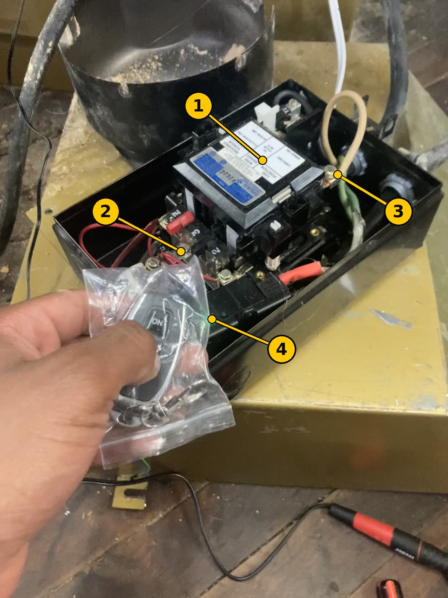
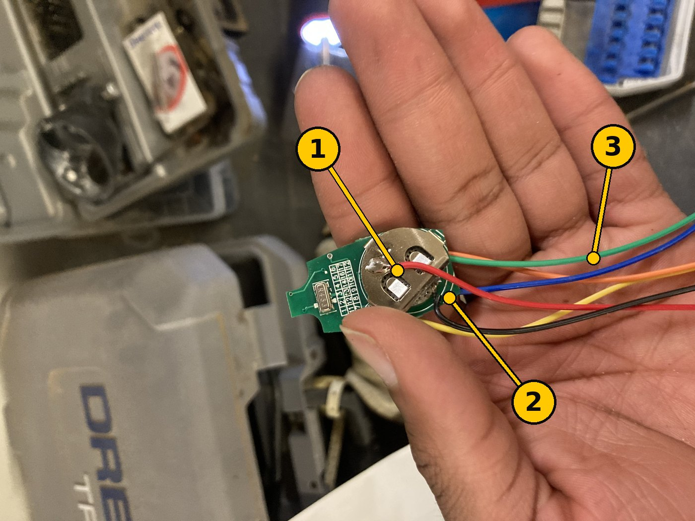
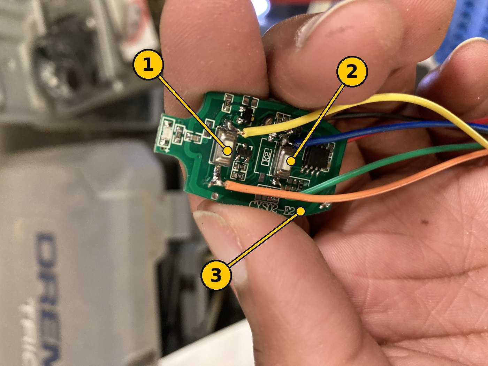
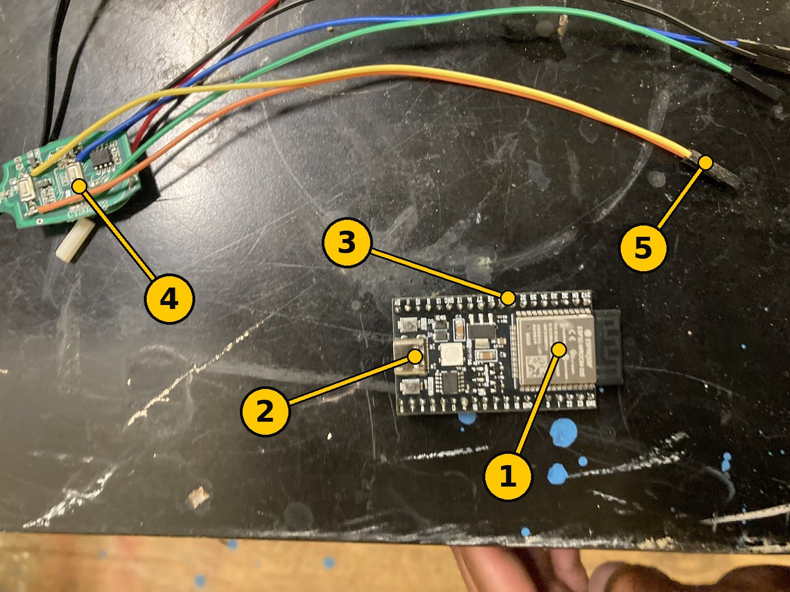

# Next steps — finishing the build

**Who this is for:** the people doing the physical work, with the project owner on a video
call guiding it. It assumes no electrical or electronics background. Where a step needs
judgement rather than hands, it says so and tells you to ask.

**This replaces [BUILD-TONIGHT.md](archive/BUILD-TONIGHT.md) as the procedure to follow.** That
document is still in the repository and still correct, but it was written for one person
working alone in a single evening, and it explains *why* far more than it explains *how*.
Read it if you want the reasoning. Follow this one for the work.

Everything below is written to be done in order. What is already built and what is still
unmeasured is in [BUILD-LOG.md](BUILD-LOG.md).

---

## The one rule

**If anything does not look like the pictures, or does not go the way the step says: stop
and ask.** Not "try the next thing" — stop.

Nothing here is urgent. This machine has been out of service for a while and one more day
costs nothing. A guess costs a hand.

There are no stupid questions on this call. The person guiding you has the schematics open
and cannot see what you see, so "I don't know which one you mean" is genuinely useful
information, not an admission of anything.

---

## Before you touch anything

### 1. The saw's power has to be locked off — not just switched off

Find the disconnect (the wall switch or breaker that feeds the saw). Put it in the **OFF**
position, and put a lock on it if there is a hasp. **Keep the key in your pocket.** Not on
the bench, not in the lock — in your pocket. That is the entire point: nobody can turn it
back on while your hands are inside.

Then have the guide walk you through checking the box is actually dead with the meter. Do
this **every time** you open the box, even if you locked it out ten minutes ago.

### 2. There is a live outlet on this machine that does not turn off with the saw

An accessory 240 V receptacle was added, fed straight from the incoming supply. It is
**deliberately outside all the protection** — it stays live when the saw's own protection
has shut everything down. It is a convenience outlet that happens to be bolted to a saw.

For this work that means one thing: **dropping the contactor does not make the box safe.**
Only the disconnect does. Details are in [BUILD-LOG.md](BUILD-LOG.md).

### 3. Safety glasses, and don't work alone in the box

Even with the power locked off. And the blade and belt still turn under gravity — if you
reach anywhere near them, take the belt off first.

---

## What you are actually building, in plain words

The saw's motor burned out its old protector because the cooling fan was packed solid with
sawdust. A blocked fan means the motor cooks itself while drawing perfectly normal current,
so nothing electrical noticed. **The point of this project is to notice heat, not amps.**

What is being added:

- A **temperature probe** clamped to the outside of the motor.
- A small computer (the **ESP32**) that reads it several times a second.
- A **radio link** — the computer holds a button on a key fob down, and a receiver in the
  saw's control box only lets the saw run while it hears that signal.

The clever part is backwards from what you would expect: the saw runs **only while the
computer is actively saying "everything is fine."** If the computer loses power, crashes,
or the probe falls off, the signal stops and the saw stops. Silence means stop.

So if this thing misbehaves, it misbehaves by **stopping the saw when it didn't need to**.
That is annoying, and it is the correct direction. A version that fails the other way is
the one that takes a hand off.

---

## The parts, and how to tell them apart

Four photographs, with numbers on them. On the call, the guide will say "the thing marked
3" — this is that list.

### The control box (already wired)



| # | What it is | What you need to know |
|---|---|---|
| **1** | **The starter** (also called the contactor). The black block with the blue and silver label reading `GOULD ITE A202C` | This is the switch that actually turns the motor on and off. Pressing Start pulls it in with a clunk. Everything this project does, it does by *interrupting* this thing's control wire — never by switching the motor directly |
| **2** | **Terminal screws.** The brass screws with wires under them | These are what get tightened in Step 1. Each one has a torque figure printed on the label inside the box |
| **3** | **The bonding (ground) conductor** — the green wire on its own screw | Safety ground for the metal box. It is not optional and it is not a spare wire. Do not disturb it |
| **4** | **A lit green indicator.** | Read this one carefully: **something in this box was powered when the photo was taken.** That is exactly why Step 1 starts with locking out the disconnect. The guide will identify what this part is on the call — it is not recorded anywhere yet |

The clear bag of hardware in the hand, and the tools on the bench, are not part of the
build. Ignore them.

### The remote — battery side



This is the key fob out of its plastic case. It is the thing that transmits the
"everything is fine" signal.

| # | What it is | What you need to know |
|---|---|---|
| **1** | **The battery holder** — the round silver clip | It is a coin cell, like a watch battery. This side of the assembly is harmless to handle |
| **2** | **The red and black wires** | Battery positive and negative, brought out so the computer can be wired in |
| **3** | **The four coloured wires** — green, blue, orange, yellow | These go to the two buttons. See the next photo |

**Handle it by the green board's edges.** Those solder joints are the whole job someone
already did; a tug on a wire pulls the pad off the board and it is a re-solder to fix.

### The remote — button side



| # | What it is | What you need to know |
|---|---|---|
| **1** | **The left button** — the silver rectangle. Yellow is soldered above it, orange below | Pressing a button here is what sends the signal. The computer is going to do that electrically instead of a finger |
| **2** | **The right button**, with blue above and green below | |
| **3** | **The board's name**, printed as `CYS02-E2` | Worth knowing if a second one ever has to be matched |

**Which button is the one we want, and which of its two wires does what, has not been
measured yet.** The pairing above is read off this photograph, nothing more. Step 3 settles
it with a meter before anything gets connected.

### The computer, and the remote's new plug



| # | What it is | What you need to know |
|---|---|---|
| **1** | **The ESP32** — the black board with the silver metal can | This is the computer. Cheap, replaceable, and there is a spare in the box |
| **2** | **The USB-C socket** | Power goes in here, and this is also how the software gets loaded in Step 2 |
| **3** | **The pin headers** — the two rows of pins along the edges | Every wire in Step 3 lands on one of these. They are labelled in tiny print; the guide will call them by name (`GPIO26`, `GPIO34`, `GND`) |
| **4** | **The remote**, same board as the two photos above | |
| **5** | **The plug ends of the remote's wires** | This is why someone fitted connectors — so the remote can be unplugged from the computer without unsoldering anything |

---

## What to have on the bench

- The **lock** for the disconnect, and somewhere to keep the key that is *on your person*
- **Safety glasses**
- A **multimeter** — the guide will tell you which setting
- **Screwdrivers**, and a **torque screwdriver** if there is one
- **Heat shrink or electrical tape**, and **wire cutters/strippers**
- A **laptop** with a USB-C cable, for Step 2. A Mac runs the one-command script; on
  **Windows** that script does not run and you type PlatformIO's own commands instead —
  see [docs/guides/flash-and-wire.html](docs/guides/flash-and-wire.html)
- A **hair dryer or heat gun**, and a mug of hot water, for Step 4
- Your **phone**, for the call and for photographs — take a photo before you change
  anything, every time

---

## The steps

### Step 1 — Make the box safe to close

**Lock out the disconnect first.** Check the box is dead with the meter.

Two jobs, on every connection inside the box:

1. **Tighten.** Every terminal screw gets checked. The torque figure is printed on the
   label inside the box — for the wire sizes used here it is **35 in-lb**. If there is no
   torque screwdriver, the guide will show you what "firm, then a little more" means, and
   note it as something to re-do properly later.
2. **Insulate.** No bare metal may be left where a finger or a dropped screwdriver could
   reach it. Heat shrink or tape over any exposed end.

**You are done when:** no bare copper is visible anywhere, and a gentle tug on any wire
moves nothing.

**Stop and ask if:** a screw will not tighten, a wire pulls out, anything looks scorched or
discoloured, or you find a wire you cannot account for.

### Step 2 — Load the software onto the computer

Bench job. The ESP32 should be sitting on the bench connected to **nothing but the laptop**.

Plug the board into the Mac with a USB-C cable, then in a terminal:

```bash
cd firmware
./scripts/flash.sh all
```

That one command installs what it needs, runs its own self-tests, finds the board, and
loads the software. It takes a few minutes and prints a lot. Then:

```bash
./scripts/flash.sh monitor
```

**You are done when:** `monitor` prints a startup banner with temperatures and threshold
numbers in it. Press `Ctrl-]` to get out.

**Stop and ask if:** the script cannot find the board (usually a cable that only carries
power and no data — try another), or it stops with an error. Copy the last twenty lines and
read them out; do not re-run it repeatedly hoping for a different answer.

A step-by-step walkthrough of this step and the next one — the actual keystrokes, what
the boot banner should say, and what each failure means — is
[docs/guides/flash-and-wire.html](docs/guides/flash-and-wire.html). Full detail lives in
[firmware/README.md](firmware/README.md).

### Step 3 — Wire the computer up

This is the longest step and the one to do slowly, on the call, one wire at a time. The
wire-by-wire list is [hardware/schematic/WIRING.md](hardware/schematic/WIRING.md) — the
guide will read from it. [docs/guides/flash-and-wire.html](docs/guides/flash-and-wire.html)
walks the same wires in order, with the reason each one is where it is.

Before any wire goes near the remote, **measure the remote's battery voltage** — red to
black, meter on DC volts. Say the number out loud. Nobody has written it down yet, and the
computer's pins are destroyed by anything above 3.3 V, so it gets checked rather than
assumed.

Three things in this step matter more than the rest:

- **The 10 kΩ pulldown resistor between `GPIO26` and `GND` is not optional.** It is what
  guarantees the saw stops while the computer is starting up or has crashed. If it is not
  fitted, nothing else in this project is trustworthy.
- **The temperature probe plugs into `GPIO34`,** and no other pin. Several pins look
  equivalent and are not.
- **Measure the divider resistor** before fitting it and write down the real number. It
  goes into the software so temperatures come out right.

**You are done when:** every line of the checklist at the end of `WIRING.md` passes.

**Stop and ask if:** you cannot find a pin, two wires seem to want the same one, or
something gets warm.

### Step 4 — Prove it actually stops the saw

**The saw stays disconnected for this.** These bench tests are the only evidence that any
of this works. Skipping them means installing a safety device that has never been observed
being safe.

With the computer running and the receiver watching, each of these must make the receiver's
relay click **off**:

1. **Heat the probe** with the hair dryer or in hot water — it should trip at its
   temperature limit.
2. **Pull the computer's power** — the relay must open within about a second.
3. **Unplug the temperature probe** while it is running — the relay must open.

If all three do what they should, the fail-safe idea is real on this bench. If any one of
them does not, **the build stops there** until it is understood. The full list, with the
reasoning, is in [BUILD-TONIGHT.md § 7](archive/BUILD-TONIGHT.md).

### Step 5 — Install everything in its final place

Mount the box and route the wires for real. Two placement rules:

- **Nothing may block airflow to the motor.** Fitting a device that detects blocked cooling
  in a way that blocks cooling would be a poor outcome, and it is an easy mistake to make.
- **Keep it out of the dust stream** and away from the fan outlet.

Cables get secured so nothing can vibrate into the belt or the blade.

### Step 6 — Insulate and tighten again, then re-test

Wires moved in Step 5, so **Step 1 and Step 4 both get done again.** This is not
box-ticking: connections that were tight on the bench come loose when a harness is pulled
into place, and that is exactly the kind of fault that shows up as an intermittent stop
three weeks later.

---

## Words you will hear on the call

| Word | What it means here |
|---|---|
| **Disconnect** | The wall switch or breaker that kills power to the whole machine. The only thing that makes the box safe |
| **Lock out** | Locking that switch off and keeping the key on you |
| **Contactor / starter** | Item 1 in the first photo. The big electrically-operated switch that runs the motor |
| **Coil** | The electromagnet inside the contactor. Power the coil, it pulls in; cut the coil, it drops out. Everything here works by cutting the coil's supply |
| **Seal-in** | The wiring trick that means the saw stays stopped after any interruption until somebody physically presses Start. It is why the saw can never restart by itself |
| **Fob / remote** | The key-fob board in photos two and three |
| **Receiver** | The radio box in the control enclosure that the fob talks to |
| **Momentary** | The receiver setting where its switch is closed *only while* it hears the radio. This setting is what makes the whole design fail safely — the guide will verify it |
| **ESP32** | The little computer. Item 1 in the fourth photo |
| **GPIO** | A numbered pin on that computer, e.g. `GPIO26` |
| **Pulldown** | The small resistor that makes a pin read "off" when nothing is driving it |
| **Probe / NTC** | The stainless temperature sensor that clamps to the motor |
| **Trip** | The system deciding to stop the saw |
| **Lockout** | After several trips in a row, the system refuses to reset itself and waits for a person to press the acknowledge button. Deliberate |

---

## Stop immediately and call if

- Anything smells hot, looks scorched, or is discoloured
- A wire is loose in a terminal, or comes out in your hand
- You find a wire or a part that nobody can identify
- The meter reads voltage somewhere that should be dead
- The receiver's switch is closed when nothing is transmitting — **this one inverts the
  entire safety design**, and it is checked deliberately in Step 4
- You are tired, or it is late, or you are being rushed

The last one is not filler. Most of the bad outcomes on jobs like this happen in the last
half hour, to someone who wanted to finish.

---

## What finishing these six steps does *not* mean

Be clear about this, because "it's installed" reads as "it's protected":

- **The passive backstop has not been bought.** The design calls for a bimetallic
  thermostat — a part that cuts the motor on temperature with no electronics involved at
  all. It is not in the box (`TASK-6` in [ARCHITECTURE.md](ARCHITECTURE.md)). Until it is,
  every protective function depends on the computer continuing to run.
- **The temperature limits are placeholders.** The real numbers come from watching the
  motor through a normal session and setting the limits around what it actually does. That
  is [BUILD-TONIGHT.md § 7](archive/BUILD-TONIGHT.md) steps 8–9, and it has not happened.
- **The fan shroud still has to be cleaned**, and the starter's overload heaters still have
  to be checked for correct sizing. Those are the original fault. A monitor installed over
  an uncleaned shroud will faithfully report a motor cooking itself.

So: finish the six steps, then treat the saw as *instrumented*, not as *protected*, until
the owner says otherwise.
