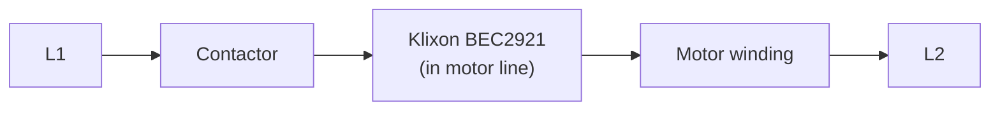
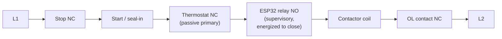

# Table Saw Thermal Protection Retrofit

Replacing a failed Klixon `BEC2921` manual-reset thermal protector on a Powermatic table saw with a two-layer protection system: a passive bimetallic thermostat as primary protection, plus an ESP32 supervisory monitor with logging and a web dashboard.

**Status:** BOM verified. Two purchased parts unusable at the winding and repurposed (see [ARCHITECTURE.md § Bill of materials](ARCHITECTURE.md#bill-of-materials)). Two build paths documented — see below.

---

## The saw

Powermatic table saw, belt-driven, cabinet-mounted motor, heavy sawdust environment. Motor is a Marathon Electric `SXA145TBFR7002AA` (Powermatic OEM part `6472028`): 3 HP, 3500 RPM, 230 V single-phase, 14.4 A FLA, TEFC frame 145TC, Class F insulation, **service factor 1.0** (no thermal margin).

Motor starter is a Gould/ITE `A202C` (NEMA Size 1) with a Type B bimetallic overload relay. The control circuit is a standard 3-wire momentary Start / maintained Stop arrangement with a seal-in auxiliary contact — this topology is load-bearing for the retrofit and is explained in [ARCHITECTURE.md](ARCHITECTURE.md#control-topology).

## How the old protection worked

A Klixon `BEC2921` phenolic thermal protector — a manual-reset snap-action bimetal device with a red pop-out plunger — was wired **in series with one motor line**, carrying full motor current. When the internal bimetal reached its calibration temperature, it snapped open, breaking the motor circuit and requiring a manual push of the plunger to reset.

This arrangement had two design weaknesses that the retrofit corrects:

1. **It carried full motor current, including locked-rotor inrush (~90–115 A).** Every start eroded the contacts. Over time, thousands of cycles + repeated thermal trips wore the mechanism to failure.
2. **When it opened, the motor stopped but the contactor stayed latched in.** The Start button remained sealed-in. When the protector cooled and was reset, or if the contacts eventually welded, the motor could resume. Protection lived downstream of the contactor instead of controlling it.

## Why it failed and had to be replaced

The Klixon tested open with the motor cold, and continuity did not restore after resetting the plunger. Motor windings tested good on all readings. The device itself had failed.

Root cause of the repeated trips that wore it out: **the TEFC fan shroud was packed solid with sawdust.** A TEFC (Totally Enclosed Fan-Cooled) motor sheds heat only through airflow over its finned frame. Block the fan, and the motor cooks at rated current. With SF 1.0 there is no headroom. The Klixon did its job — repeatedly — until it couldn't.

This diagnosis has an important consequence for the replacement: **current sensing alone would never have caught this.** The starter's overload heaters see amps, not degrees, and the motor was drawing normal current the whole time it was overheating. **Temperature sensing is the point of the whole project.**

An exact `BEC2921` replacement (or Sensata supersession) would restore original function but would leave both design weaknesses in place and would not warn before the next trip.

## Two build paths

BOM verification revealed the purchased NTC probe tops out at 125 °C (below the trip point) and the "wireless switch" is a fob-driven RF receiver, not a GPIO-controllable relay. Rather than wait on new parts, this project documents two routes:

### Path A — Tonight's build → [BUILD-TONIGHT.md](BUILD-TONIGHT.md)

Same-day protection using only parts on hand. Fail-safe via a **heartbeat** design: the ESP32 continuously transmits through the 433 MHz fob to a receiver programmed in *momentary* mode. Anything that stops the transmission — power loss, firmware hang, sensor fault, watchdog reset, jamming — opens the receiver's relay and stops the saw.

- Sensor: repurposed NTC on the **motor frame** (not the winding). Advisory-precision but adequate as long as the delta between healthy and unhealthy frame temperature is what you're detecting.
- Isolation: USB phone charger — a UL-listed reinforced-isolation AC-DC supply, freely available.
- No passive thermostat yet.
- Nuisance-stop-prone by design. That's the correct direction — the alternative is unprotected running.

### Path B — Full retrofit → [ARCHITECTURE.md](ARCHITECTURE.md)

End-state design. Two independent layers wired in series with the contactor coil:

- **Layer 1 — Bimetallic thermostat.** Passive, snap-action, normally closed, opens on rise, auto-reset. Primary protection. If everything else is unplugged, the saw is still thermally protected.
- **Layer 2 — ESP32 supervisor.** K-type thermocouple bonded to the winding end turns via an AlN substrate, read through a MAX31855. Drives a **wired, opto-isolated relay** (energized-to-close) directly from a GPIO — no RF in the safety path.
- Trip threshold below the thermostat's, so the ESP32 acts first in normal operation. The thermostat is the backstop.
- Rate-of-rise tracking on a local web dashboard warns before a trip — the genuinely new capability, because it can tell the operator the shroud needs cleaning *before* the motor cooks.

Path B is what the saw ends up with. Path A is what gets it running until the missing parts (thermostat, K-type + MAX31855, isolated bench supply) arrive.

## Safety principles

Enforced by topology, not by trust in firmware. Both build paths honor these:

1. **Fail-safe or fail-stopped.** Every fault path — firmware hang, sensor open, power loss, watchdog timeout, unhandled exception — stops the saw. No failure mode may leave the saw running with protection disabled.
2. **Interrupt-only.** Nothing in this system can *energize* the contactor coil. The only permitted electrical function is opening a series contact.
3. **Passive primary retained** (Path B). The bimetallic thermostat is independent of the ESP32.
4. **No autonomous restart.** Cooldown re-closes the relay, but the 3-wire seal-in means the saw does not restart until someone presses the physical Start button.
5. **Sensor faults are trips.** No "last known good," no "assume ambient."

Full requirements and rationale are in [ARCHITECTURE.md § Safety requirements](ARCHITECTURE.md#safety-requirements).

## Prerequisite work

Two things must happen before any firmware or wiring:

1. **Clean the fan shroud completely** and identify why the saw was packing dust into it. A monitoring system installed under the same cooling conditions will faithfully report a motor cooking itself.
2. **Pull the starter's overload heaters and verify sizing.** With SF 1.0 and 14.4 A FLA, NEC caps overload protection at 115% → **16.5 A maximum**. If a previous owner oversized them, the current-protection half is already compromised and no amount of temperature sensing fixes that.

## Operator instructions

For the person who uses the saw day-to-day. Print this page and stick it inside the cabinet door.

### Reading the LED

| Pattern | What it means | What to do |
|---|---|---|
| **Solid** | Armed. Ready. | Press Start. |
| **Slow blink** | Cooling down. | Wait for solid, then press Start. |
| **Fast blink** | Thermal trip. Motor is hot. | Wait for slow blink, then solid. Check the fan shroud is clear. |
| **Double-blink** | Sensor fault. | Do not use. Check the probe wiring. |
| **Triple-blink** | Locked out after too many trips. | Fix the cause first, then press ack once the motor is cool. |
| **SOS pattern** | Boot failure. | Do not use. Power-cycle. If it repeats, get the builder. |
| **Off** | No power to the monitor. | Do not use. Check the wall disconnect and the ESP32's power. |

The LED tells you the *family* of problem. For the specific fault and what to do about
it, see the **error codes** in [`docs/codes/`](docs/codes/) — one page per fault, written
to be read at the machine. The same pages are served from the saw itself, so they work
with no internet.

### After a trip

1. Wait for the LED to stop flashing and go solid.
2. **Lock out the disconnect before you go near the fan shroud.** Solid means the relay has already re-closed — from that moment a press of Start spins the fan.
3. Look at the fan shroud on the back of the motor. Is it packed with dust? Clean it with compressed air before running again — that's the root cause of most trips.
4. Restore the disconnect, wait for the LED to go solid again, and press Start.
5. Watch the first cut. If the LED goes to fast-blink within a few minutes at normal load, the motor still isn't shedding heat. Stop and investigate before continuing.

### The saw won't start

If Start doesn't pull in the contactor:

- Check the LED. Anything other than solid means the monitor is holding the coil open — the machine is behaving correctly, wait or clean the shroud.
- If the LED is solid but the contactor still won't pull in: the overload relay's red reset button may have popped, or — once it is fitted — the bimetallic thermostat may be open and will re-close on its own as the motor cools. Check those. Neither of them logs anything, so the dashboard will show a healthy saw that refuses to start.
- Anything more than that: lock out the disconnect, verify with a meter, and open the starter enclosure.

### Never

- Never bypass the monitor. If the LED says "do not use," the answer is not "unplug the ESP32."
- Never open the starter enclosure without locking out the disconnect first.
- Never reach into the fan shroud without locking out the disconnect first. The supervisor re-closes its relay on its own once the motor cools.
- Never let the fan shroud stay packed with dust. That is the failure mode this whole system was built to catch.

---

## Repository layout

| Path | Contents |
|---|---|
| [`ARCHITECTURE.md`](ARCHITECTURE.md) | Full retrofit design — hardware, firmware, safety requirements, commissioning. Current design of record. |
| [`BUILD-TONIGHT.md`](BUILD-TONIGHT.md) | Self-contained same-day expedient build using only parts on hand. |
| [`docs/codes/`](docs/codes/) | Error code registry. One page per fault, with operator remediation. Single source for the GitHub pages, the offline bundle served from the saw, and the firmware's code table. |
| [`tools/`](tools/) | `codedocs.py` — builds those three artifacts and validates them against `ARCHITECTURE.md` in CI. |
| [`hardware/`](hardware/) | Physical build artifacts — schematics, BOM.csv, photos, datasheets. Stub for now; the design lives in `ARCHITECTURE.md` until it does. |
| [`firmware/`](firmware/) | ESP32 supervisor source — src, tests, build config. Stub for now; the design lives in `ARCHITECTURE.md § Reference pseudocode` until it does. |
| [`CHANGELOG.md`](CHANGELOG.md) | Change history, and what the version number in `VERSION` covers. |
| [`LICENSE`](LICENSE) | MIT + safety-scope notice. |

---

## Liability note

This retrofit modifies a UL-listed motor and voids its listing. For a private shop that is the owner's call. If this saw is ever used in a commercial, institutional, insured-workshop, or teaching setting, the correct answer is a listed replacement protector and this project is not appropriate.
