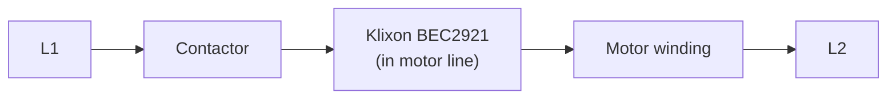
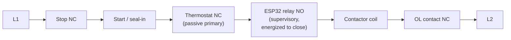

# Table Saw Thermal Protection Retrofit

Replacing a failed Klixon `BEC2921` manual-reset thermal protector on a Powermatic table saw with a two-layer protection system: a passive bimetallic thermostat as primary protection, plus an ESP32 supervisory monitor with logging and a web dashboard.

**Status:** Parts purchased, design phase. No firmware yet. Several BOM items still need verification — see [ARCHITECTURE.md](ARCHITECTURE.md#bill-of-materials).

---

## The saw

Powermatic table saw, belt-driven, cabinet-mounted motor, heavy sawdust environment. Motor is a Marathon Electric `SXA145TBFR7002AA` (Powermatic OEM part `6472028`): 3 HP, 3500 RPM, 230 V single-phase, 14.4 A FLA, TEFC frame 145TC, Class F insulation, **service factor 1.0** (no thermal margin).

Motor starter is a Gould/ITE `A202C` (NEMA Size 1) with a Type B bimetallic overload relay. The control circuit is a standard 3-wire momentary Start / maintained Stop arrangement with a seal-in auxiliary contact — this topology is load-bearing for the retrofit and is explained in [ARCHITECTURE.md](ARCHITECTURE.md#control-topology).

## How the old protection worked

A Klixon `BEC2921` phenolic thermal protector — a manual-reset snap-action bimetal device with a red pop-out plunger — was wired **in series with one motor line**, carrying full motor current. When the internal bimetal reached its calibration temperature, it snapped open, breaking the motor circuit and requiring a manual push of the plunger to reset.

This arrangement had two design weaknesses that the retrofit corrects:

1. **It carried full motor current, including locked-rotor inrush (~90–115 A).** Every start eroded the contacts. Over time, thousands of cycles + repeated thermal trips wore the mechanism to failure.
2. **When it opened, the motor stopped but the contactor stayed latched in.** The Start button remained sealed-in. When the protector cooled and was reset, or if the contacts eventually welded, the motor could resume. Protection lived downstream of the contactor instead of controlling it.

## Why it failed and had to be replaced

The Klixon tested open with the motor cold, and continuity did not restore after resetting the plunger. Motor windings tested good on all readings. The device itself had failed.

Root cause of the repeated trips that wore it out: **the TEFC fan shroud was packed solid with sawdust.** A TEFC (Totally Enclosed Fan-Cooled) motor sheds heat only through airflow over its finned frame. Block the fan, and the motor cooks at rated current. With SF 1.0 there is no headroom. The Klixon did its job — repeatedly — until it couldn't.

This diagnosis has an important consequence for the replacement: **current sensing alone would never have caught this.** The starter's overload heaters see amps, not degrees, and the motor was drawing normal current the whole time it was overheating. **Temperature sensing is the point of the whole project.**

An exact `BEC2921` replacement (or Sensata supersession) would restore original function but would leave both design weaknesses in place and would not warn before the next trip.

## The new system, at a high level

Two layers of protection, both wired **in series with the contactor coil circuit** — not the motor line. Either layer opening drops the contactor, which drops the seal-in, which stops the saw and requires a human to press Start to resume.

**Layer 1 — Bimetallic thermostat.** Passive, snap-action, normally closed, opens on temperature rise, auto-reset. No firmware, no power supply, no software failure modes. This is the primary protection. If everything else in this project is unplugged, the saw is still thermally protected.

**Layer 2 — ESP32 supervisor.** A temperature sensor bonded to the winding end turns feeds an ESP32, which drives a relay in series with the coil. The relay is **normally open, energized to close**, so any firmware fault, sensor fault, watchdog timeout, or loss of power opens the relay and stops the saw. The ESP32 trips at a threshold *below* the thermostat's, so in normal operation it always acts first — the thermostat is the backstop.

Two things the ESP32 provides that the original design never could:

- **Early warning.** Rate-of-rise tracking and a warn threshold below the trip point mean the operator can be told the shroud needs cleaning *before* a trip.
- **History.** Trip events, cooldown curves, and steady-state temperatures are logged to flash and served on a local web dashboard.

The web interface is advisory only. It can display state, history, and alerts; it can acknowledge a fault. It **cannot** lower thresholds, force-arm the relay, or override the protection loop. Wi-Fi down = system still protects.

## Safety principles

Enforced by topology, not by trust in firmware:

1. **Fail-safe or fail-stopped.** Every fault path — firmware hang, sensor open, power loss, watchdog timeout, unhandled exception — stops the saw. There is no acceptable failure mode where the saw runs with protection disabled.
2. **Interrupt-only.** Nothing in this system can *energize* the contactor coil. The only permitted electrical function is opening a series contact.
3. **Passive primary retained.** The bimetallic thermostat is independent of the ESP32.
4. **No autonomous restart.** Cooldown re-closes the relay, but the 3-wire seal-in means the saw does not restart until someone presses the physical Start button at the machine.
5. **Sensor faults are trips.** No "last known good," no "assume ambient."

Full requirements and rationale are in [ARCHITECTURE.md](ARCHITECTURE.md#safety-requirements).

## Prerequisite work

Two things must happen before any firmware or wiring:

1. **Clean the fan shroud completely** and identify why the saw was packing dust into it. A monitoring system installed under the same cooling conditions will faithfully report a motor cooking itself.
2. **Pull the starter's overload heaters and verify sizing.** With SF 1.0 and 14.4 A FLA, NEC caps overload protection at 115% → **16.5 A maximum**. If a previous owner oversized them, the current-protection half is already compromised and no amount of temperature sensing fixes that.

## Liability note

This retrofit modifies a UL-listed motor and voids its listing. For a private shop that is the owner's call. If this saw is ever used in a commercial, institutional, insured-workshop, or teaching setting, the correct answer is a listed replacement protector and this project is not appropriate.
